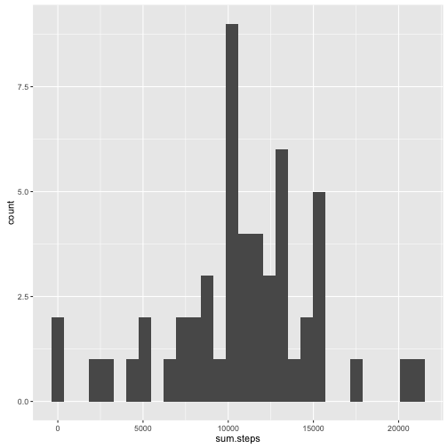
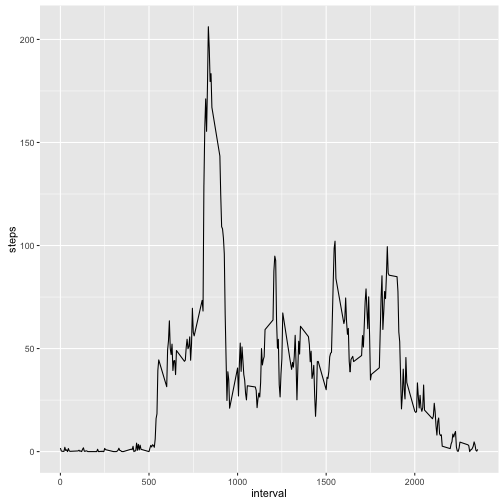
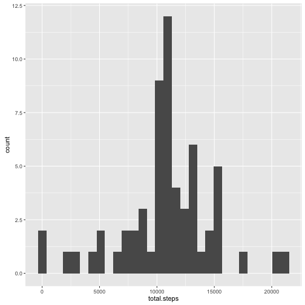
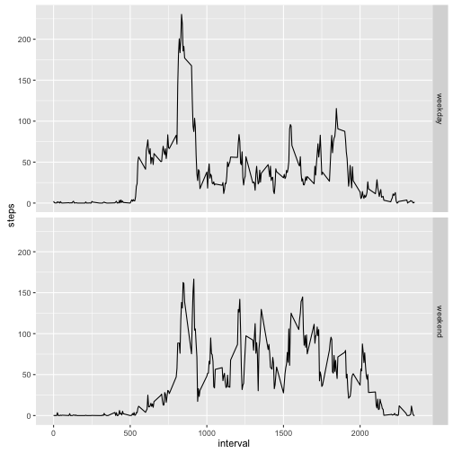

**Loading and preprocessing the data**

```r
unzip('activity.zip')
x <- read.csv('activity.csv')
library(dplyr)
library(ggplot2)
library(lubridate)
```

**What is mean total number of steps taken per day?**

```r
by.day <- group_by(x, date)
ggplot(summarize(by.day, sum.steps = sum(steps)), aes(sum.steps)) + geom_histogram()
```



```r
totals <- summarize(by.day, total.steps = sum(steps))
tot.mean <- mean(totals$total.steps, na.rm = T)
tot.median <- median(totals$total.steps, na.rm = T)
```
The mean for all of the days is 1.0766189 &times; 10<sup>4</sup> steps, and the median for all of the days is 10765 steps.

**What is the average daily activity pattern?**

```r
by.interval <- summarize(group_by(x,interval), steps=mean(steps, na.rm = T))
ggplot(by.interval, aes(interval, steps)) + geom_line()
```



```r
max <- by.interval$interval[which.max(by.interval$steps)]
```
The 835 time interval contains the largest number of steps, on average.

**Inputing missing values**

```r
y <- x
missing <- is.na(y$steps)
tot.missing <- sum(missing)
```
The data set is missing 2304 values.

The empty values will be filled with the average for the interval.

```r
for (row in 1:nrow(y)){
  if (is.na(y[row,1])){
    y[row,1] <- by.interval[by.interval$interval == y[row,3],2]
  }
}
y.by.day <- group_by(y, date)
y.totals <- summarize(y.by.day, total.steps = sum(steps))
ggplot(y.totals, aes(total.steps)) + geom_histogram()
```



```r
y.tot.mean <- mean(y.totals$total.steps)
y.tot.median <- median(y.totals$total.steps)
```
With the missing values filled in, the mean is 1.0766189 &times; 10<sup>4</sup>, compared to 1.0766189 &times; 10<sup>4</sup> for the original data set. Similarly, the median for the data set with the filled in values is 1.0766189 &times; 10<sup>4</sup>, compared to 10765 for the original data set.

With this method of filling the data, the mean remains the same, but the median changes.

**Are there differences in activity patterns between weekdays and weekends?**

```r
y$day <- 'weekday'
y$day[weekdays(ymd(as.character(y$date))) == "Saturday" | weekdays(ymd(as.character(y$date))) == "Sunday" ] <- 'weekend'
y$day <- as.factor(y$day)
y.by.interval <- summarize(group_by(y, interval, day), steps=mean(steps))
ggplot(y.by.interval, aes(interval, steps)) + geom_line() + facet_grid(day~.)
```


